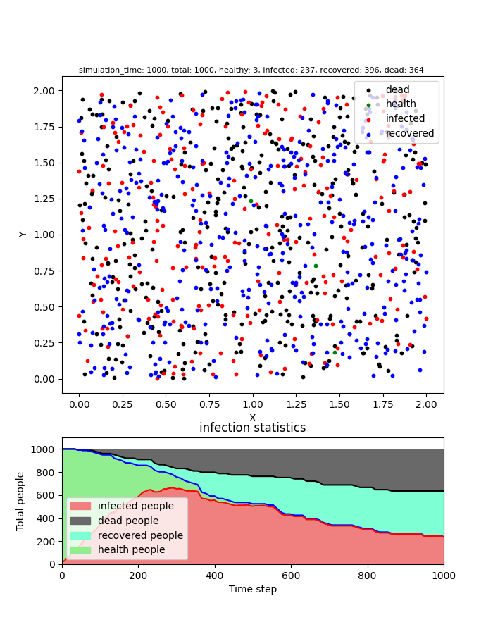
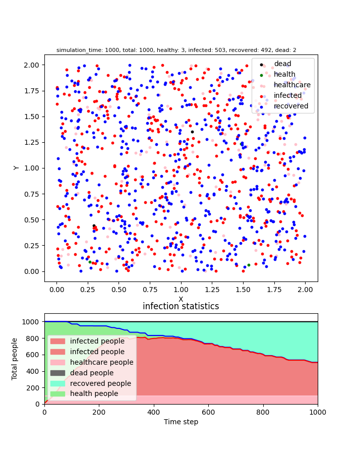
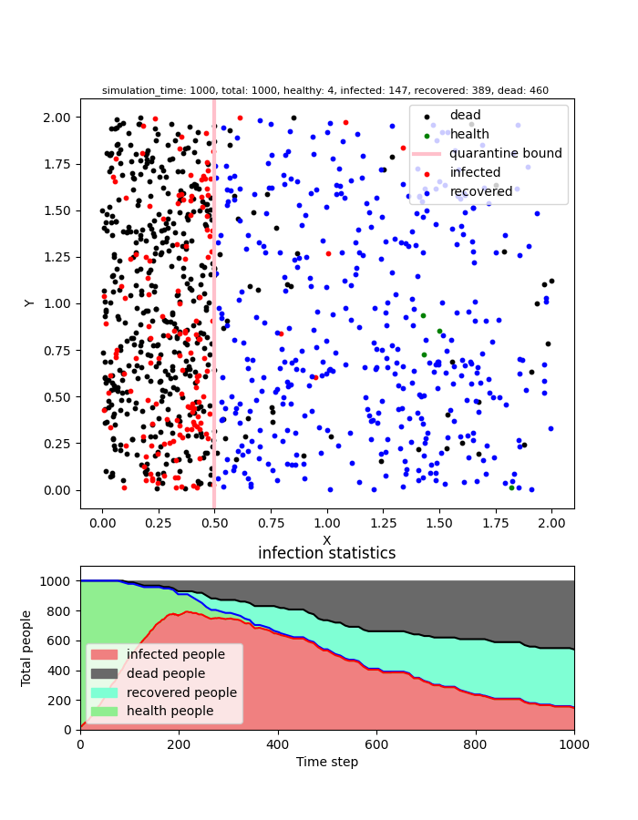
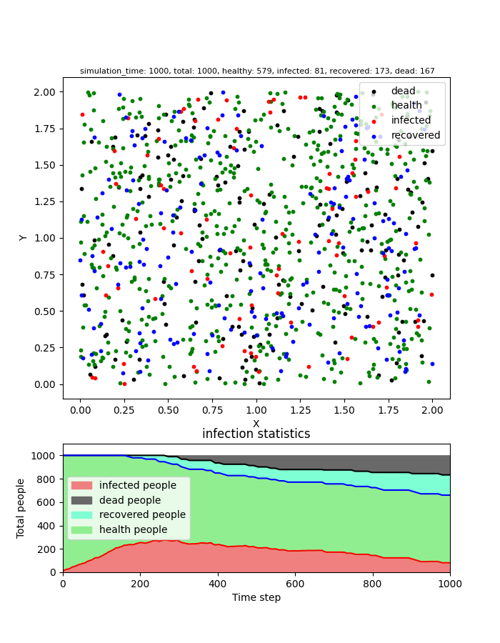
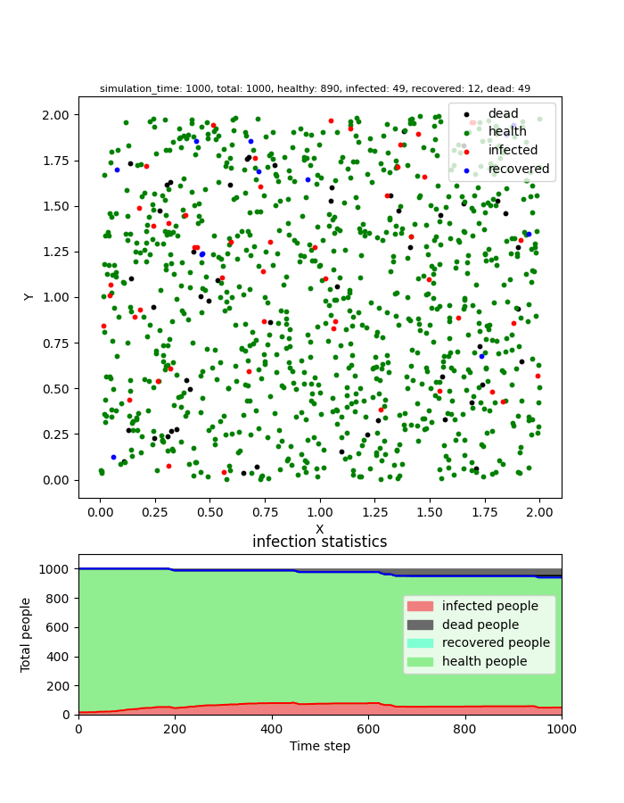

# NSD Term Project (f-21)
## A-simple-virus-spread-simulation
``` Author: Eric Zhong```

## Overview

A simple virus spread simulation, which can modify config.py to set the simulation configuration and run it.

This simulation use C++ computing power to speed up the calculation process in the simulation process and use python to visualize the simulation results.

This simulation combine C++ and python3 by pybind11.

## Build environment

Install the dependencies with Poetry.

``` bash
poetry install --no-dev
```

Compile the \*.so file for run simulation.

``` bash
make
```

## Set config

Modify simulation config in config.py before run simulation.

``` bash
vim config.py
```

## Run

Run simulation using the Poetry environment.

``` bash
poetry run python3 main.py
```

The visualization results of the simulation will saved in ./output_images/Simulation_policy{policy number}.png.

## Simulation result

config

``` python

# all input parameter
# total number of people for simulation(optional, default = 1000(<= 10000))
TOTAL_POPULATION = 1000
# init number of infected people(percentage)(optional, default =
# 1 %)
INFECTED_PEOPLE = 0.01
# moving speed of people(optional, default = 3)
MOVE_SPEED = 19
# virus infection rate(optional, default = 0.7)
INFECTED_RATE = 0.7
# virus mortality rate(optional, default = 0.001)
MORTALITY_RATE = 0.001
# recovery rate(optional, default = 0.001)
RECOVERY_RATE = 0.001
# healthcare capacity(optional, default = 100, The mortality rate is
# halved.)
HEALTHCARE_CAPACITY = 100

MODE = 2
# Max simulation step, default = 1000
SIMULATION_STEP = 1000
# the distance of move one step(every iter move one step), default = 0.001
MOVE_STEP = 0.001
# Virus transmission range, default = 0.02
SPREAD_RANGE = 0.02

POLICY = 0 - 4

# If policy = 2, the probability of an infected person being quarantined.
ACCEPT_ISOLATION_RATE = 0.95

# Simulation boundary
LEFT_X = 0.0
RIGHT_X = 2.0
UP_Y = 2.0
DOWN_Y = 0.0
```

policy = 0 : free


Final result



---

policy = 1 : free with healthcare (healthcare can reduce the mortality rate by half.)


Final result



---

policy = 2 : Attempted quarantine (infected people will go to quarantine area.)


Final result



---

policy = 3 : Moderate distancing (60% people can not move)


Final result



---

policy = 4 : Extensive distancing (90% people can not move)


Final result



---

## References

1. [Why outbreaks like coronavirus spread exponentially, and how to “flatten the curve”](https://www.washingtonpost.com/graphics/2020/world/corona-simulator/)

2. [python_corona_simulation](https://github.com/paulvangentcom/python_corona_simulation)

---

### proposal
https://github.com/Eric860730/nsdhw_21au/tree/Eric860730-proposal-submission/proposal/Eric860730

### Completion
11/24 [Feat] Success run on pybind and add test for read class data.

12/14 [Feat] Can run easy simulation on pure cpp environment without policy.

12/16 [Feat] Can run on python with pybind and plot result graph.

12/18 [Feat] Github Action done.

12/18 [Feat] Can plot simulation result as animation.

12/20 [Feat] Finish plot and accelerate simulation time.

12/21 [Feat] Finish all basic policy.

12/28 [Feat] Modify the code structure and accelerate the simulation time successfully.

### Next goal
Prepare final presentation.

### Schedule

:white_check_mark: Week 1: Parser, Simulator

:white_check_mark: Week 2: Simulator(policy: Free)

:white_check_mark: Week 3: Simulator(policy: Attempted quarantine)

:white_check_mark: Week 4: Simulator(policy: Moderate distancing)

:white_check_mark: Week 5: Simulator(policy: Extensive distancing)

:white_check_mark: Week 6: Printer

:white_check_mark: Week 7: Code Optimized.

:red_circle: current doing ---> Week 8: Prepare final presentation.

### TODO

:white_check_mark: Combine my cpp with python by pybind and visualize.

:white_check_mark: Github Action.

:white_check_mark: Increase policy.

:white_large_square: Increase customized policy.

#### for performance

:white_check_mark: Change the type of infected_person from vector to map at line 165 in MySimulator.cpp.

:white_check_mark: Optimized the Simulation time on 10000 population. (total simulation time < 2s)

:white_large_square: Use QT QUICK to accelerate visualization.
